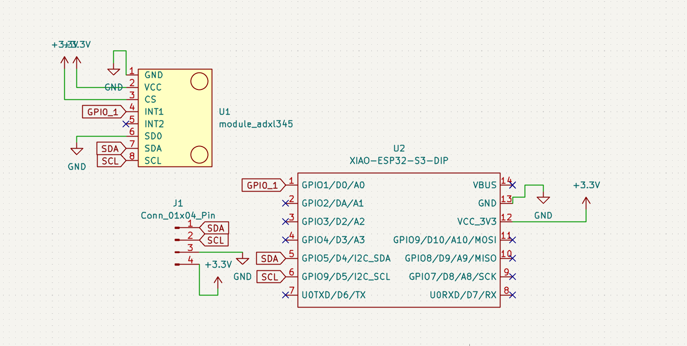
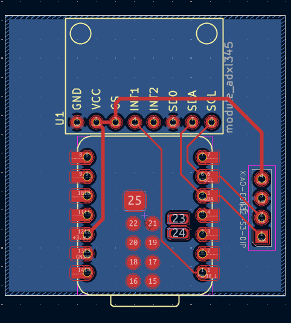

# Introduction
I built this project as a fun way to learn more about PCB, CAD and firmware design. I spent quite a lot of time on it and learned a lot especially about CAD modelling. I hope to show it off by hooking it up to my keys and other accessories.

# How it works
The Xiao ESP32-S3 reads tilt from the ADXL345 accelerometer. This is used to create interactive animations displayed on the OLED. As of right now, there is only one "game", the ball game. As you tilt the device the ball starts speeding up in that direction and slows down over time from "friction." The ball also bounces off the edge, which is displayed as a white box. The device will support more of these interactive animations and the animations will be cycled by tap detection on the accelerometer module. This version of the Xiao supports a rechargeable battery with an on-board charging module, which this device will utilize.

# Firmware flashing

1. Install Arduino IDE
2. Add ESP 32 board support: Click on file, preferences, then paste this into the additional board managers URL (https://raw.githubusercontent.com/espressif/arduino-esp32/gh-pages/package_esp32_index.json)
3. Select tools, board, then board manager. Search ESP 32 and install it
4. Select tools, board, esp32, then select Xiao ESP-32-S3 and plug in the device.
5. Hit sketch, then upload 

# Challenges
All went quite smoothly except for the CAD modelling part. I used Fusion only once and that was by following a tutorial. Therefore, this project gave me a massive headache! I had lots of trouble just doing the most basic and minute things such as creating a sketch, projecting onto a sketch, etc. However, due to the immense amount of time I spent, I learned a lot regarding the basics of Fusion and spending so much time on it just made completing the final design more rewarding. I am very proud of how it turned out. 

# PCB design
The schematic and PCB were made using the open-source software KiCad. I made sure to use global net variables for the schematic because otherwise, I would be left with incomprehensible messy wiring. The PCB uses a two-layer system. The top layer (F.Cu) is used for routing traces, whereas the bottom layer (B.Cu) is used for grounding using copper fill zones. I made sure to make the power traces 0.5mm in thickness as recommended by professionals in the industry.

| Schematic | PCB |
|-----------|-----|
|  |  |

### PCB and Schematic files

* **Project:** [Tokeychain.kicad_pro](PCB/Tokeychain.kicad_pro)
* **PCB:** [Tokeychain.kicad_pcb](PCB/Tokeychain.kicad_pcb)
* **Schematic:** [Tokeychain.kicad_sch](PCB/Tokeychain.kicad_sch)
* **Gerbers:** [Tokeychain_Gerbers.zip](PCB/Tokeychain_Gerbers.zip)

# CAD design
The CAD components were built using AutoDesk Fusion software. The components are all inside a 38x50x20 mm 3D-printed case with a key loop at the top and a USB-C cutout at the bottom. The back is covered using a snap-fit cover.

| Fusion Snapshot |
|------------------|
|  |

### CAD & Print Files

* **Preview:** [Tokeychain_assembled.png](CAD%20MODEL/Tokeychain_assembled.png)
* **3D Model:** [Tokeychain.stl](CAD%20MODEL/Tokeychain.stl)
* **Source File:** [Tokeychain_assembled.f3z](CAD%20MODEL/Tokeychain_assembled.f3z)
* **Step file:** [Tokeychain_assembled.step](CAD%20MODEL/Tokeychain_assembled.step)

